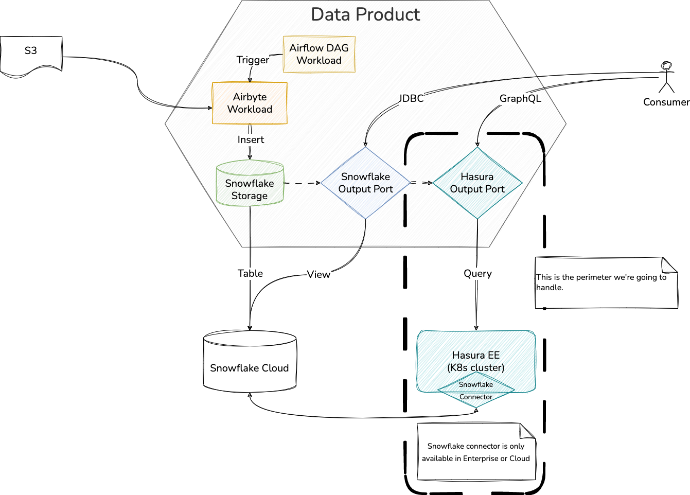

# High Level Design

This document describes the High Level Design of the Hasura Specific Provisioner and associated Webhook/Role Mapper.

The source diagrams can be found and edited in the [accompanying draw.io file](hld.drawio).

## Overview

The Output Ports provisioned by this SP are meant to be provisioned on top of other OPs, for which Hasura must have a connector available; see https://hasura.io/docs/latest/databases/overview/ for an overview of the supported technologies and information on the SDK for extending them.

For the purpose of this document, we'll assume the underlying OPs are Snowflake-based.

With this in mind, let's look at an example DP and the infrastructure supporting its OPs; the dashed outline marks the perimeter we'll be handling.

*Figure 1: Data Product example*

In order to handle this perimeter there are two components that work together:
- The Hasura SP microservice
- The Webhook/Role Mapper microservice

The interactions between these components and the rest of the infrastructure are outlined in *Figure 2*.

*Figure 2: overview of the interactions between the components*

## Provisioning and unprovisioning

The provisioning and unprovisioning operations for the OP are responsible for actually setting up the resources needed on the target systems; in the case of Hasura, this means tracking/untracking the tables of the underlying OP so that Hasura creates the proper GraphQL types and queries/mutations. During the provisioning phase the SP also sets up the role that will be used to manage access to the data of the OP.

In doing this, some validations are also performed; these validations can also be performed separately with the dedicated endpoint as per usual.

*Figure 3* provides details on the provisioning and unprovisioning flow, with examples of the requests performed by the various components.

*Figure 3: provisoning and unprovisioning flow*

## ACL management and role mapping

The other key role of the SP is to manage the updates to the ACLs of the OPs it provisions according to what Witboost defines them to be.

In this case most of the complexity resides in the Webhook/Role Mapping component, which is responsible for handling the mapping of users/groups to the proper roles.

*Figure 4* shows the tables used for this.

*Figure 4: roles and role mapping tables*

*Figure 5* provides details on the ACL update flow, with examples of the requests performed by the various components.

*Figure 5: ACL update flow*

## Authentication and authorization

The final part that we need to handle is the actual data consumption. Namely, how does the user authenticate, and how does the platform verify his identity and enforce the proper authorization rules.

This is outlined in *Figure 5* below.

*Figure 5: authentication and authorization*
